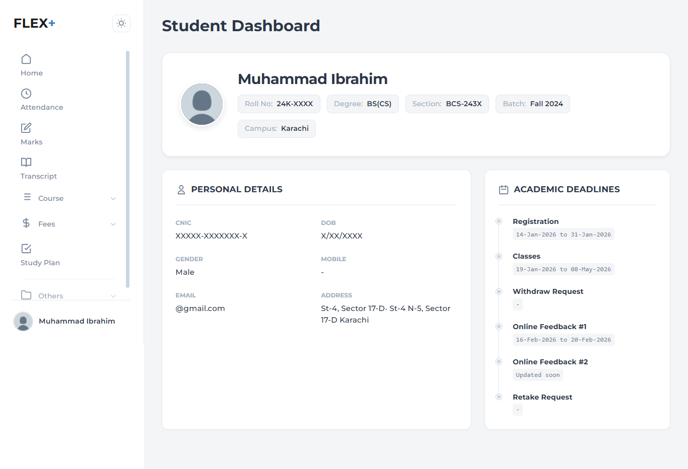
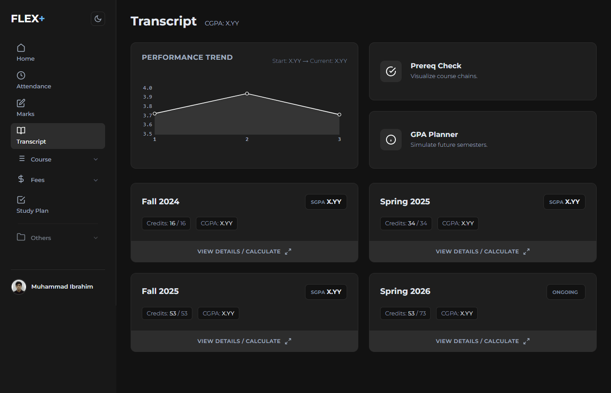
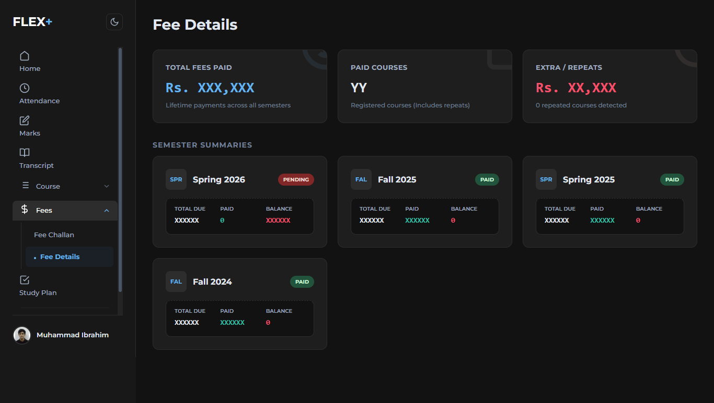
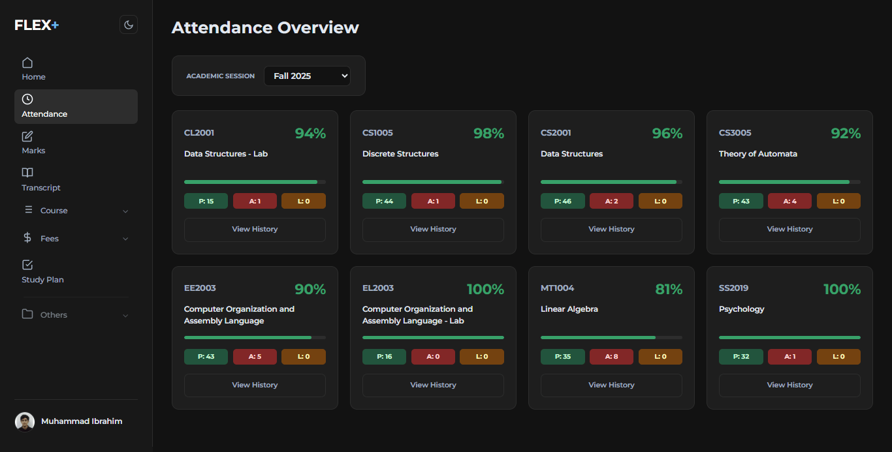
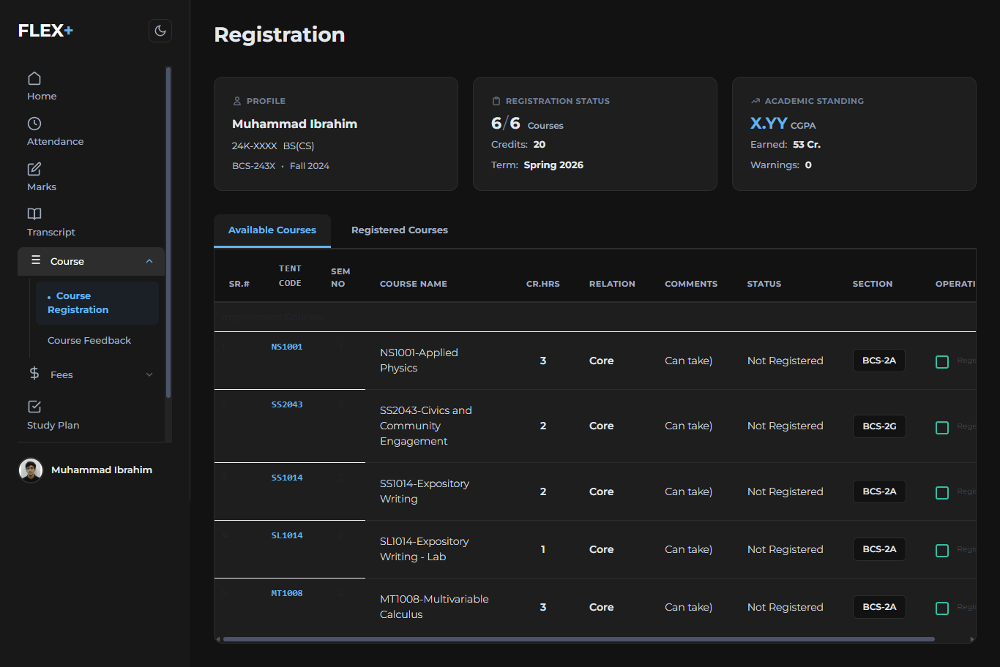
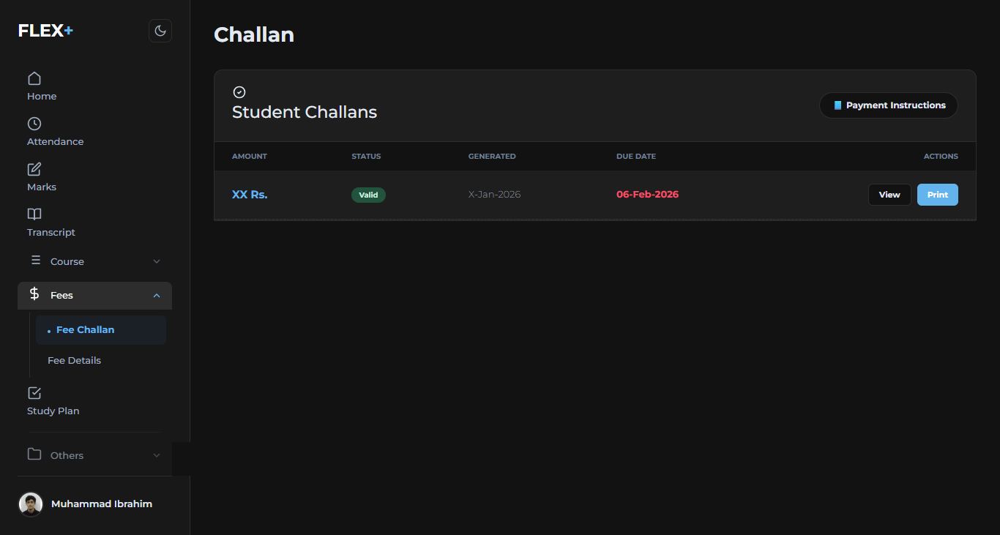

# FLEX+ (Flex NUCES Student Redesign)

**FLEX+** is a browser extension that modernizes the **Flex Student Portal** for FAST NUCES University. It transforms the legacy, table-heavy interface into a responsive, card-based dashboard with advanced analytics and theming capabilities.

**How it works:** FLEX+ operates as a **"Parasitic UI"**. It suppresses the original interface, scrapes the data as it loads, and renders a modern dashboard in its place. (Note: It may take 1-2 seconds to inject the UI upon page load).

## ⚡ Installation

Since this is a developer extension, you will install it via Chrome's "Load Unpacked" feature.

1.  **Download:** Clone this repository or download the ZIP and extract it to a folder (e.g., `Reflex-Extension`).
2.  **Open Extensions:** Go to `chrome://extensions/` in your browser.
3.  **Enable Developer Mode:** Toggle the switch in the top-right corner.
4.  **Load:** Click **"Load unpacked"** and select the folder containing `manifest.json`.
5.  **Run:** Visit the [Flex Student Portal](https://flexstudent.nu.edu.pk/) and login. The new UI will activate automatically.

---

## ✨ Features

FLEX+ goes beyond a simple visual overhaul by adding data-driven tools that the original portal lacks.

### 🎨 Theming Engine
* **5-State Toggle:** Cycle through **Light, Dark, Midnight, Forest,** and **Sunset** modes.
* **Persistence:** Your preference is saved locally and applies instantly on every page load.

---

### 🎓 Transcript Power-Tools (Priority Feature)
* **GPA Planner / Simulator:** Enter hypothetical grades for current courses to see how they impact your final CGPA.
* **Prerequisite Checker:** Visualizes course dependencies (e.g., visual warnings if you haven't passed a prerequisite).
* **Smart GPA:** Auto-calculates SGPA excluding "Withdrawn" or "Non-Credit" courses for better accuracy.

---

### 📊 Fee Analytics (Priority Feature)
Instead of a confusing ledger, get a comprehensive financial health check.
* **Lifetime Spend:** Calculates the exact total of fees paid since admission.
* **Course Audit:** Counts total courses registered vs. passed.
* **Repeat Cost Calculator:** Automatically detects repeated courses and estimates the "extra" money spent on retakes (e.g., "Rs. 19,500 extra spent on repeats").

---

### 📂 Other Modernized Modules
We have also redesigned the core daily drivers:
* **Attendance:** Clean visualization of absents vs. allowed leaves.
* **Challan Generation:** Simplified one-click challan printing.
* **Course Registration:** A clutter-free interface for selecting courses.

  
  
  

---

## ⚙️ How It Works

Reflex operates using a **"Shadow DOM"** technique to ensure compatibility with the university's legacy system.

1.  **Hide:** The original `.m-portlet` grids are set to `visibility: hidden` and `height: 0`. They remain in the DOM so the site's internal ASP.NET scripts don't crash.
2.  **Scrape:** The extension reads text, links, and data attributes from these hidden elements.
3.  **Render:** A new container (`#modern-root`) is appended to the `<body>` where the clean UI is drawn.

### The "AJAX Bridge"
For pages like **Fee Details** that load data asynchronously:
* **MutationObservers:** FLEX+ watches the page for changes. When the original site's AJAX completes, our observer detects the new data and triggers a UI rebuild.
* **Automated Triggers:** For semester breakdowns, the extension programmatically "clicks" the hidden buttons of the legacy site in the background, waits for the data to populate, and then scrapes it into a modern Modal.
